# Вопросы по Архитектуре аппаратных средств

## № 1 (Классификация микро-ЭВМ.)

- Универсальные
  - Многопользовательские (1)
  - Однопользовательские (2)
- Специализированные
  - Многопользовательские (Серверы) (3)
  - Однопользовательские (Рабочие станции) (4)
  - Сетевые компьютеры (5)

1. Мощные микрокомпьютеры, которые оборудованы несколькими видеотерминалами и работающими в режиме распределения времени. Это позволяет работать одновременно нескольких пользователей.
2. Данные ПК удовлетворяет требованиям общей доступности.
3. Многопользовательские мощные компьютеры в вычислительных сетях. Выделены для обработки запросов от всех компьютеров сети.
4. Узкоспециализированные компьютеры для определённого вида работ.
5. Упрощённые микрокомпьютеры, обеспечивающие работу в сети и доступ к сетевым ресурсам.

## № 2 (Принципы фон Неймана.)

- Информация кодируется в двоичном коде
- Данные хранятся в одной и той же памяти. И располагаются по способу использования, но не кодирования
- Данные размещаются в ячейках памяти ЭВМ и идентифицируются адресами.
- Принцип последовательного программного управления: программа состоит из совокупности команд, которые выполняются CPU последовательно друг за другом.
- Возможно присутствие условного перехода, которые меняют последовательно выполнения команд в зависимости от значения хранимых данных	

## № 3 (Архитектура ЭВМ по фон Нейману. Основные составляющие.)

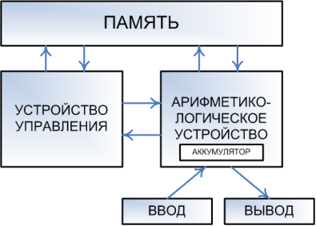

- Арифметико-логическое устройство (АЛУ) - выполняет алгебраические и логические вычисления.
- Память - хранит данные. сохраняются результаты выполнения арифметических и логических команд.
- Устройство управления (УУ) - обеспечивает выполнение процессором последовательности команд программы.
- Аккумулятор - сохраняет результаты выполнения арифметических и логических команд.

## № 4 (Классификация ПК по типоразмерам.)

1. Сверх-большие ЭВМ (Супер-ЭВМ) - многопроцессорные вычислительные системы, быстродействие которых достигает от 100 млн до нескольких десятков миллиардов операций в секунду.

2. Большие ЭВМ (Mainframe) - одни их самых мощных компьютеров. Применяются в крупных организациях или в отраслях народного хозяйства.

   Штат обслуживания много десятков человек.

   Одними из задач являются:

   1. Научно-технические
   2. Пакетная обработка
   3. Работа с СУБД

3. Малые ЭВМ (Мини ЭВМ) - обычные PC.

4. Сверх малые ЭВМ (Микро ЭВМ) - ЭВМ очень малого класса и низкой производительности.

## № 5 (SISD, SIMD, MISD и MIMD вычислительные системы.)

- SISD (Single Instruction, Single Data) - система в которой существует одиночный поток команд и одиночный поток данных.
- SIMD (Single Instruction, Multiple Data) - система с одиночным потоком команд и множественным потоком данных. Позволяет обеспечить параллелизм на уровне данных.
- MISD (Multiple Instruction, Single Data) - система с множественным потоком команд и одиночным потоком данных. Архитектура параллельных вычислений, где несколько функциональных модулей выполняют различные операции над одними данными.
- MIMD (Multiple Instruction, Multiple Data) - система с множественным потоком команд и множественным потоком данных. Позволяет обеспечить параллелизм вычислений.

## № 6 (Архитектура многопроцессорных систем с общей (разделяемой) памятью. NUMA и UMA.)

UMA (Uniform Memory Access) - это архитектура с общей памятью для многопроцессорных систем. В этой модели используется единственная память, к которой обращаются все процессоры представленной многопроцессорной системы. Каждый процессор имеет равное время доступа к памяти (задержка) и скорость доступа. Он может использовать либо одну шину, несколько шин.

NUMA (Non-uniform Memory Access) - также является многопроцессорной моделью, в которой каждый процессор связан с выделенной памятью. Однако эти небольшие части памяти объединяются в единое адресное пространство. Главное, над чем подумать, это то, что в отличие от UMA время доступа к памяти зависит от расстояния, на котором расположен процессор, что означает изменение времени доступа к памяти. Это позволяет получить доступ к любой ячейке памяти, используя физический адрес.

Ключевые различия между UMA и NUMA:

1. Модель UMA (совместно используемая память) использует один или два контроллера памяти. В отличие от этого, NUMA может иметь несколько контроллеров памяти для доступа к памяти.
2. В архитектуре UMA используются одиночные, множественные и перекрестные шины. И наоборот, NUMA использует иерархические и древовидные типы шин и сетевых подключений.
3. В UMA время доступа к памяти для каждого процессора одинаково, в то время как в NUMA время доступа к памяти изменяется по мере изменения расстояния памяти от процессора.
4. Приложения общего назначения и разделения времени подходят для машин UMA. В отличие от этого, подходящее приложение для NUMA ориентировано в режиме реального времени и критично ко времени.
5. Параллельные системы на основе UMA работают медленнее, чем системы NUMA.
6. Когда речь идет о пропускной способности UMA, имеют ограниченную пропускную способность. Напротив, NUMA имеет пропускную способность больше, чем UMA.

## № 7 (Мультикомпьютеры. Архитектура многопроцессорных систем с распределённой памятью.)

Многопроцессорные системы с распределённой памятью не обеспечивают общего доступа ко всей имеющийся памяти (NORMA).

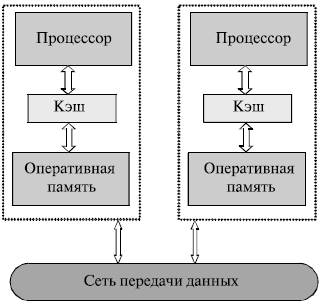

Каждый процессор системы может использовать только свою локальную память, при этом доступ к данным на других CPU необходимо явно выполнить передачу сообщений. Данный подход выполняется для МРР и кластеров.

Кластер - множество отдельных ПК, объединённых в сеть, для которых при помощи специальных программных средств обеспечиваются возможность унифицированного управления (SSI). Кластеры могут быть организованны уже на имеющихся ПК, либо организованы из типовых компьютерных элементов.

Для параллельного управления в алгоритмах решения задач достаточно выделить только крупные независимые части расчётов.

## № 8 (RISC, CISC - процессоры. Достоинства и недостатки.)

- CISC (Complex Instruction Set Computer) - компьютеры с полным набором команд.

  Достоинства:

  - Нефиксированное значение длины команд.
  - Арифметические действия кодируются в одну команду.
  - Небольшое число регистров, каждый из которых вызывает строго определённую функцию.

  Недостатки:

  - Команды оказываются сильно неравнозначными по времени и требовали сложного и длительного декодирования.
  - На кристалле оставалось мало места для кэша.

- RISC (Reduced Instruction Set Computer) - архитектура с сокращённым набором инструкций. Начало положено компанией IBM в 1975.

  Сокращённый набор команд - инструкции разделены на действия, результаты которых могут быть вычислены за 1 такт.

  Особенности:

  - Любая операция должна выполнятся за один такт, вне зависимости от её типа.
  - Система команд должна содержать минимальное кол-во наиболее часто используемых простейших инструкций одинаковой длины.
  - Операции обработки данных реализуются только в формате "регистр-регистр".

## № 9 (Синтез КС. Понятие "Базис".  Виды базисов.) (Не Закончено!!!)

Базис - функциональный набор элементов с помощью которого можно реализовать сколько угодно сложную переключательную функцию.

Виды базисов:

- Базис Буля (И или НЕ. AND or NOT)
- Базис Шеффера (И, НЕ, and-not)
- Базис Пирса (ИЛИ, НЕ, or-not)

## № 10 (Демультиплексоры и мультиплексоры. Назначение, типы, УГО.)

Демультиплексор (DMX) - передаёт сигнал с информационного входа на один из выходов - его номер равен десятичному эквиваленту двоичного кода на адресных выходах.

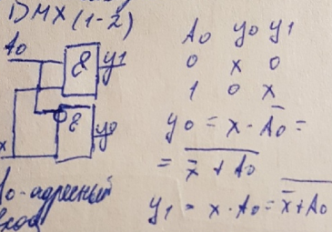

Мультиплексор (MUX) - передача сигнала с одного из информационных входов, номер равен десятичному эквиваленту.

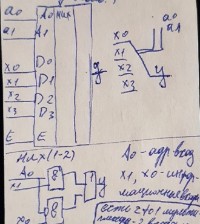

## № 11 (Преобразователи кода. Применение, типы, УГО.)

Преобразователи кода:

- Весовые X/Y - преобразуют информацию из одной системы счисления в другую (CD/DC).

  

  

- Не весовые X/Y - преобразуют информацию для дальнейшего отображения.

  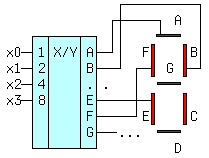

## № 12 (Сумматоры и полусумматоры. Назначение, типы, УГО.)

- SM (Сумматор) - сложение одноразрядных двоичных чисел.

  |  A   |  B   | E (сумма) |
  | :--: | :--: | :-------: |
  |  0   |  0   |     0     |
  |  0   |  1   |     1     |
  |  1   |  0   |     1     |
  |  1   |  1   |     0     |

- HS (Полусумматор) - комбинационная логическая схема, имеющая два входа и два выхода.

  |  A   |  B   | E (сумма) |
  | :--: | :--: | :-------: |
  |  0   |  0   |     0     |
  |  0   |  1   |     1     |
  |  1   |  0   |     1     |
  |  1   |  1   |     0     |

## № 13 (Дешифратор и шифратор. Назначение, УГО.)

- DC (Decoder) - дешифратор, преобразует код на входах в сигнал на выходе, номер выхода равен десятичному эквиваленту двоичного кода.

  В полном дешифраторе кол-во выходов:
  $$
  m = 2^n
  $$
  где n - число входов. В неполном дешифраторе:
  $$
  m < 2^n
  $$

  | N10  | Вход | Вход |  E   | Выход | Выход | Выход | Выход |
  | :--: | :--: | :--: | :--: | :---: | :---: | :---: | :---: |
  |      |  A1  |  A0  |      |  y3   |  y2   |  y1   |  y0   |
  |  0   |  0   |  0   |  1   |   0   |   0   |   0   |   1   |
  |  1   |  0   |  1   |  1   |   0   |   0   |   1   |   0   |
  |  2   |  1   |  0   |  1   |   0   |   1   |   0   |   0   |
  |  3   |  1   |  1   |  1   |   1   |   0   |   0   |   0   |
  |  x   |  x   |  x   |  0   |   0   |   0   |   0   |   0   |

  

  DC применяются:

  - В вычислительной технике
  - Как часть больших интегральных схем
  - Преобразование кодов

- CD (Encoder) - шифратор, преобразует десятичный номер активного входа в двоичный эквивалент этого номера. В базисе ИЛИ-НЕ

  

## № 14 (Определения микропроцессор и МПС. Обобщённая структура микропроцессора.)

Микропроцессор – программно управляемое устройство постоянное на одной или нескольких бис и служит для обработки информации и управлением процессом этой обработки

МПС (микропроцессорная система) - вычислительно контрольно измерительная или управляющая система, обрабатывающем элементом которой является микропроцессор

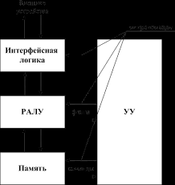

Регистровое арифметико-логическое устройство (РАЛУ) – предназначено для выполнения арифметических и логических операций и хранения промежуточных результатов операций.

Интерфейсная логика обеспечивает электрическое сопряжение с внешними устройствами и формирование протокола обмена микропроцессора с периферийными устройствами.

Память предназначена для хранения программ и данных. Всегда состоит из ОЗУ и ПЗУ. В минимальной конфигурации вычислительной системы в ПЗУ находится программа загрузки.

Устройство управления (УУ) обеспечивает выработку последовательности микрокоманд, задающих различные операции, выполняемые АЛУ, интерфейсной логикой и памятью. Для организации команд условного перехода в АЛУ формируются условия, которые располагаются в регистре состояния и используются устройством управления для формирования последовательности выборки команд.

## № 15 (Контроллер ПДП (DMA). Принцип работы.)

DMA (Direct Memory Access) - это режим обмена данных между устройствами или между устройствами и памятью RAM без участия CPU. В результате увеличивается скорость передачи информации, так как данные не пересылаются через CPU.

Принципы:

1. CPU программирует DMA, устанавливая его регистры, затем процессор даёт команду устройству, чтобы оно могло читать данные в виртуальном буфере.
2. DMA посылает запрос на HDD на чтение. После завершения записи, процесс повторяется, пока значение счётчика не будет равно нулю. После завершения цикла устройство инициализирует прерывание процессора. Это прерывание отвечает за завершение процесса передачи данных

## № 16 (Материнские платы ПК. Основные форм-факторы. Устройства на материнской плате.)

Материнская плата - служит для обеспечения взаимодействия между всеми компонентами PC.

Форм-факторы:

- WTX (356x425mm) (Для серверов)
- ATX (305x244mm) (Для обычных корпусов)
- Mini-ATX (284x208mm) (Для малых корпусов)
- Micro-ATX (244x244mm) (Для сверхмалых корпусов)

Основные компоненты:

- Socket - разъём для процессора
- Слот RAM
- PCI - предназначен для установки WiFi модулей, GPS-приёмников, слотов расширения USB и дополнительных модулей I/O
- PCI-Express - предназначен для 
- Сетевая карта -
- BIOS - чип, для а также внешняя микропрограмма. Включается при запуске компьютера для проверки и настройки оборудования
- CLR_CMOS (Jammer) - отмычка для очистки памяти CMOS (Заводские настройки для BIOS)
- Батарейка RTC - для сохранения настроек BIOS и ведения реального времени
- IDE (устарел) - для HDD и CD-ROM
- FDD (устарел) - для Floppy дисков
- SATA - для HDD и CD-ROM
- Колодки - разъём под внешние USB
- SPDIF - звуковые разъёмы (для обхода южного моста)
- ATX (24, 20 pin) - разъём питания материнской платы (раньше ATA)
- ATX12V - для питания CPU. от 4 до 8 выводов
- CPU FAN - для питания кулера
- PWR_FAN, SYS_FAN - питание для корпусных кулеров
- F_PANEL - для подключения кнопок компьютера, светодиодов и внешнего звукового канала
- F_AUDIO - для подключения внешнего гнезда для наушников и микрофонов
- CODEC - звукового карта

## № 17 (Чипсет. Основные составляющие и из назначение)

Чипсет - размещаемый на материнской плате набор микросхем, выполняющий роль связующего компонента (моста), обеспечивающего взаимодействие CPU с разными компонентами памяти, устройствами ввода и вывода, контроллерами и периферию через системную шину.

Составляющие:
  1. Северный мост - отвечает за процессор, оперативную память и видеокарту.
  2. Южный мост - периферийные устройства.

  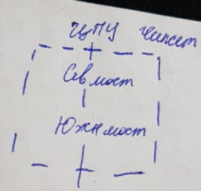

## № 18 (Виды корпусов PC)

- Моноблок
  - Rack (для серверного оборудования)
  - Barebone
  - AT (старый, на смену пришёл ATX)
- Горизонтальные корпуса
  - Desktop (Настольные)
  - FootPrint (Напольные)
  - SlimLine (Тонкие)
  - UltraSlim
- Вертикальные корпуса
  - Super/Ultra Tower
  - Full Tower (до 20x60x100 cm)
  - Big Tower (190x482x820 mm)
  - Mid Tower (183x432x490 mm)
  - Mini Tower (178x432x432 mm)
  - Micro Tower (для низко производительных PC)
  
## № 19 (Системные шины GTL, FSB и HyperTransport)

1. GTL (Gunning Transceiver Logic) - системная шина объединяет несколько магистралей:

   - Данных
   - Адресов
   - Служебную
   - Питания

   в конечном итоге они подключаются к разъёму процессора. Разрядность шины данных в значительной мере определяет производительность процессора. 

2. FSB (Front Side Bus) - системная шина используемая для связи CPU с северным мостом в 1990-х и 2000-х годах. Шина была разработана Intel и впервые использовалась в компьютерах на базе Intel Pentium.

3. HyperTransport - Высокоскоростной последовательный интерфейс. Работает на частотах от 200MHz до 3.2Ghz. Использует DDR, что означает, что данные посылаются, как по переднему, так и по заднему фронтам сигнала синхронизации, что позволяет осуществлять до 5200 миллионов посылок в секунд, при частоте 2,6 GHz.

## № 20 (Шины ISA, PCI, PCI-Express, AGP. Основные теоретические сведения.)

1. Шина ISA - 8 или 16 разрядная шина ввода/вывода, которая служит для подключения плат расширения. Разработана IBM.

2. Шина PCI – стандартная шина для подключения периферийных устройств, среди которых звуковые карты, платы для захвата видео и т.д. Одной из основных возможностей является синхронный 32 или 64 разрядный обмен данными.

3. PCI-Express – последовательный интерфейс, является самым современным интерфейсом для графических карт. В тоже время, он подходит и для установки других карт расширения.

   Особенности:

   - Физическое соединение осуществляется при помощи медных проводников
   - Имеет максимальную пропускную способность для каждого вывода
   - Имеет встроенную системную синхронизацию, которая позволяет быстро изменять частоту
   - Кол-во полос пропускания может быть x1, x2, x4, x8, x16, x32. При этом частота пропускания может быть до 10 GHz.
   - Низкое время задержки
   - Уровень сигнала - 0,8V

4. Шина AGP - специализированная 32-разрядная шина для видеокарты.

   Ее отличия от PCI:

   - Работа на тактовой частоте 66MHz
   - Увеличенная пропускная способность
   - Режим работы с памятью DMA и DME
   - Разделение процессов на операцию и передачу данных
   - Большой объём памяти не требуется, так как видеопамять находится в общем адресном пространстве

## № 21 (Шины ATA (IDE), SCSI. Основные теоретические сведения)

1. ATA (IDE) - электроника встроенная в привод. Параллельный интерфейс, так же называется PATA (Parallel ATA). Используется для подключения накопителей информации (HDD, CD/DVD ROM).

   Разъём на периферийных устройствах и платах имеют 40 выводов. Соединительный кабель представляет собой 40 или 80 жильный шлейф. При помощи шлейфа можно установить два устройства (master, slave). Макс. длина кабеля 40cm.

2. SCSI (Small Computer System Interface) - параллельный интерфейс, разработанный для объединения на одной шине различных по своему назначению устройств, например как жёсткий диск.

   Контролер SCSI является самостоятельным процессором при этом имеет собственный BIOS. К шине может быть подключено до 15 устройств. С шиной SCSI одновременно могут работать несколько устройств.

   Для подключения используется плоский шлейф на концах которого расположены разъёмы 25, 50, 68 пин. В шине содержится 8 линий данных.

   Имеется два способа передачи данных:
   
   - Однополярный - 1 провод
   - Дифференциальный - используется два провода
   
   Каждое устройство имеет свой ID (либо 0-7, 0-15). Плата контроллера имеет либо ID 7, 15.
   На концах кабелей устанавливается терминатор (для согласования помех и устранения эхо).
   Ширина шины - 8, 16 бит.
   Частота - 5Mhz, 10MHz , 20 MHz, 40 Mhz.
   Физ. реализация - оптический, однополярный, дифференцированный.

## № 22 (Шины SATA и SAS. Основные теоретические сведения.)

1. SATA (Serial ATA) - последовательный интерфейс обмена данными, улучшенная версия ATA (PATA).

   В отличии от 40-контактного разъёма у ATA, SATA использует 7-контактный, а также более устойчив к многократному подключению.

   Разъём питания SATA подаёт 3 напряжения питания: 

   - +12V (жёлтый цвет)
   - +5V (красный цвет)
   - +3.3V (используется не всегда, оранжевый провод)
   - Чёрный провод - заземление.

   Каждому устройству полагается отдельный кабель, что снимает проблему невозможности одновременной работы устройств, находящихся на одном кабеле.

2. SAS (Serial Attached SCSI) - последовательный компьютерный интерфейс, разработанный для подключения различных устройств хранения данных, например жёстких дисков. Разработан для замены параллельного интерфейса SCSI.

   Накопители с интерфейсом SAS можно подключить только к контроллеру SAS. При этом накопители SATA можно подключить, как к контроллеру SATA так и SAS.

## № 23 (Интерфейс ACPI и шина SMBus. Основные теоретические сведения.)

1. ACPI (Advanced Configuration and Power Interface) - общий интерфейс для обнаружения аппаратного обеспечения, управления питанием и конфигурации материнской платы и устройств. В ACPI 2.0 была добавлена поддержка 64-разрядных микропроцессоров, поддержка различных типов памяти, устройств PCI и PCI-X. В настоящий момент последней версией является ACPI 6.2a.

   Основной задачей ACPI - является обеспечить взаимодействие между операционной системой, аппаратным обеспечением и BIOS материнской платы.

2. SMBus (System Managment Bus) - последовательный протокол обмена данными для устройств питания, основан на шине I2C.

   SMBUS - двухпроводной интерфейс, по которому простые устройства могут обмениваться информацией с остальной системой. Благодаря этому:

   - Уменьшается кол-во проводов
   -  Гарантируется дальнейшая наращиваемость путём приёма сообщений по протоколу I2C.
   
   Назначение SMBus:
   - Определение объёма и конфигурация памяти
   - Предоставление информации изготовителя
   - Сообщение системе номер модели и номер по каталогу устройства
   - Сообщение о различных типах ошибок
   - Отключение тактовой частоты на свободных разъёмах памяти
   - Определение пониженного напряжения батареи

## № 24 (COM-порт, IrDA и LPT. Основные теоретические сведения)

1. COM-порт (COMmunication port) - двунаправленный последовательный интерфейс, предназначенный для обмена байтовой информацией.

   Использовался для подключения терминала, позже для модема и мыши. Сейчас используется для соединения с источниками бесперебойного питания.

2. IrDA - Infrated Data Association, ИК-порт. Может быть как двунаправленным, так и однонаправленным (сейчас в основном однонаправленный). Основной недостаток который послужил причиной отказа от IrDA - ограниченная дальность действия и требования прямой видимости пары приёмник-передатчик.

3. LPT (IEEE-1284) - используется для подключения к компьютеру принтера, сканера и других внешних устройств. 

## № 25 (Шина USB. Основные теоретические сведения. Стандарты USB. Технология Power Delivery.)

USB (Universal Serial Bus) - универсальная последовательная шина, предназначенная для многократного подключения периферийных устройств.

Для подключения периферийных устройств используется 4-х пиновый кабель (витая пара) до 5m:

- 2 провода отвечают за питание +5V (красный провод), GRD (чёрный провод)
- 2 провода Data+ (зелёный провод), Data- (белый провод)
- 5-й провод оплётка (экран)

Стандарты USB

| Спецификация      |  Скорость  | Стандарт USB                            |
| ----------------- | :--------: | --------------------------------------- |
| High-speed        | до 480Mbps | USB 2.0                                 |
| Superspeed        |  до 5Gbps  | USB 3.0 / USB 3.1 Gen 1 / USB 3.2 Gen 1 |
| Superspeed+10Gbps | до 10Gbps  | USB 3.1 Gen 2 / USB 3.2 Gen 2           |

Технология Power Delivery - позволяет гибко управлять питанием через шину USB и обеспечивает передачу энергии до 100 Вт.

## № 26 (Шина FireWire, порт Bluetooth. Основные теоретические сведения)

1. FireWire (IEEE-1394) - последовательный интерфейс, используется для подключения цифровых видеокамер, внешних жёстких дисков и различных сетевых устройств. Для подключения устройств используется 6 жильный медный кабель или оптоволокно.

   Состав кабеля:

   - 2 провода под питание. Напряжение 8-40V. Ток 1,5A.

   - 4 провода - 2 экранированные витые пары для передачи информации. 

   Макс. длина 4.5m.

   Основные скорости (Mbps): 100, 200, 400, 800, 1600, 3200.

   Типы:

   - Type A (4-pin, 6-pin)
   - Type B (9-pin)

2. Bluetooth - обеспечивает обмен информации между, устройствами на надёжной, бесплатной, повсеместно доступной радиочастоте для ближней связи (2,4-2,4835GHz).

   Версии:

   - Bluetooth 1.0 - 1998
   - Bluetooth 1.1
   - Bluetooth 1.2
   - Bluetooth 2.0
   - Bluetooth 3.0
   - Bluetooth 4.0
   - Bluetooth 4.1
   - Bluetooth 4.2
   - Bluetooth 5.0 - Самый распространённый. Макс. дальность 400m
   - Bluetooth 5.1

   Типы соединения:

   - P2P
   - Звезда
   - Распределённая звезда

## № 27 (Внешние запоминающие устройства. Принципы записи и чтения информации.)

Внешние Запоминающие Устройства (ВЗУ) - устройства для хранения, чтения и записи информации. Основные свойства ВЗУ - энергонезависимость, отсутствие прямой связи с процессором.

Принципы:

1. Магнитный признак
    Основан на перемещении магнитных участков носителей относительно головки. Чтение и запись производится на треке.

    Достоинства:

    - Высокая плотность записи

    Недостатки:

    - Износ механический частей
    - Чувствительность к вибрации

2. Оптический признак
    Чтение и запись происходит при помощи лазера

    Особенности:

    1. Степень прозрачности
    2. Коэффициент отражения

    Достоинства:

    - Относительно высокая плотность записи
    - Долгой срок хранения информации
    - Минимальное влияние внешних факторов
    - Простота тиражирования

    Недостатки:

    - Сложный процесс перезаписи
    - Невысокая скорость
    
3. Электрический признак
    Основан на пороговом эффекте в полупроводниковых средствах. Для изменения состояния памяти требуется некоторая электрическая энергия. Существует несколько видов данной памяти:

    - Флеш-память
    - EEPROM (Electrically Erasable Programmable Read-Only)

    Достоинства:

    - Скорость
	- Отсутствие движущихся частей
    - Относительно низкое потребление энергии
    
    Недостатки:

    - Чем больше размер, тем меньше скорость
	- Ограниченное кол-во циклов перезаписи

## № 28 (Накопитель на жёстких магнитных дисках. Конструкция накопителя.)

HDD (Hard Disk Drive) - энергонезависимое перезаписываемое запоминающее устройство.

Информация записывается на алюминиевые или керамические диски, покрытые ферромагнитным материалом. На шпинделе двигателя HDD может быть закреплено как один так и несколько дисков. В рабочем режиме, магнитные головки не касаются поверхности дисков, благодаря потоку воздуха. Расстояние между головкой и диском составляет 2-10nm. При отсутствии вращения, магнитная головка находится на шпинделе (парковочное место).

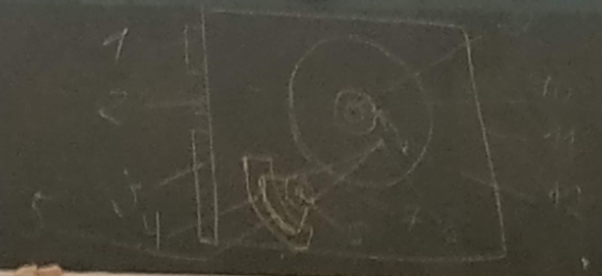

HDD состоит из:

1. Разъёма питания
2. Конфигурационных перемычек
3. Интерфейсного разъёма
4. Постоянного магнита (динамический привод)
5. Катушки позиционирования (динамический привод)
6. Оси позиционера
7. Позиционера (коромысла)
8. Магнитной головки
9. Оси вращения дисков (шпинделя)
10. Магнитных дисков
11. Корпуса
12. Гермозоны

## № 29 (Виды адресации данных в накопителях на жёстких магнитных дисках. Сервоинформация.)

HDD делится на треки (дорожки). Треки делятся на сектора. Совокупность секторов называется кластером.
Совокупность дорожек, находящихся на равном расстоянии от центра диска по периметру.

Системы адресации:

- CHS (Cylinder Head Sector) - система адресации сектора, как минимальной единицы хранения данных в HDD, основанная на использовании физических адресов геометрии диска.
- LBA (Logical Block Addressing) - способ нумерации секторов, не зависящий от внутренней физической архитектуры. Каждому сектору назначается свой ID.

Разметка:

- MBR - содержит загрузочный код и таблицу разделов

  Недостатки:

  - Максимум 2TB (Остальная часть диска становится нечитаемой)
  - Только 4 первичный раздела

- GPT (GUID Partition Entries Array) - таблица разделов

  Преимущества:

  - Backup таблицы разделов
  - Кол-во разделов более 4-х
  - Работа с дисками более 2TB

Сервоинформация - специальные метки, необходимые для сближения головок. Такая информация записывается при низкоуровневым форматировании.

## № 30 (Основные компоненты блока электроники на жёстких магнитных дисках.)

Блок электроники - отдельная съёмная плата находящаяся на HDD, которая включает в себя:

- Управляющий контроллер
- Блок ПЗУ
- Буферная память (Кэш) - сглаживает разницу скоростей между интерфейсом и жёстким диском
- Цифровой (сигнальный) процессор - обработка и декодирование считываемого сигнала

## № 31 (Оптические носители информации. Виды оптических носителей: CD-ROM, CD-R, CD-RW.)

Оптические накопители - съёмные накопители информации, предназначенные для записи/чтения/хранения/распространения пользовательских данных.

CD диски состоят из поликарбонатной основы, отражающего слоя и защитного слоя. Углубление называются питами, а ровная отражающая поверхность - площадкой. Переход от площадки к питу воспринимается приёмником как бит. Источником луча является лазер.

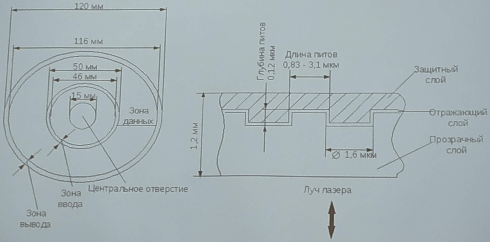

- CD-ROM - диск с записанными данными, доступными только для чтения.

- CD-R - диск однократной записи.

  В качестве регистрирующего слоя используется органический краситель. При записи происходит нагревание, после которого остаётся след на красителе.

- CD-RW - перезаписываемый диск.

  Использует процесс изменения состояния фазы вещества (сплав серебра, сурьмы и индия). Температура записи - 500°C. Для стирания информации - 200°C.

Во всех трёх дисках имеется 3 области:

1. Служебная информация - адреса записей, число записей, суммарное время
2. Область данных
3. Служебная информация - выходная директория

## № 32 (Конструкция CD-ROM привода. Структурная схема. Основные узлы.)

CD привод используется для чтения CD дисков (CD-ROM, CD-R, CD-RW).

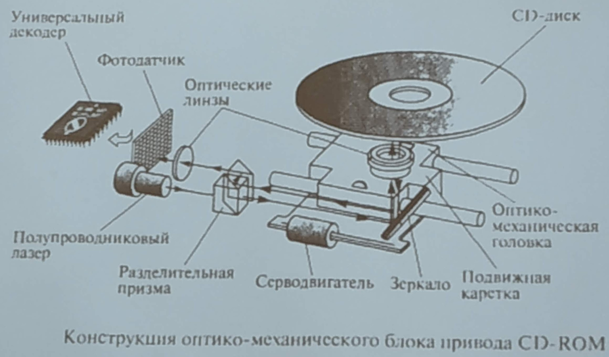

Строение CD привода:

- Полупроводниковый лазер - источник когерентного излучения
- Шпиндельный двигатель - вращение диска
- Устройство фокусировки - устройство управления оптическими линзами (оптико-механический блок)
- Система зеркал - перенаправление луча лазера (оптико-механический блок)
- Разделительная призма - формирует два пути прохождения лазера
- Фотоприёмник - быстродействующий приёмник изменения луча лазера

Основные блоки оптического привода:

- Входной блок - предварительная обработка сигналов от оптической головки
- Блок автофокусировки
- Блок слежения за дорожкой - выбор трека
- Система ФАЧ (Фазовая Автоподстройка Частоты) - генератор и фазовый детектор
- Серводвигатель
- Микропроцессор

## № 33 (Оптические носители информации. Виды оптических носителей: DVD-ROM, DVD-R, DVD-RAM, DVD-RW, DVD+RW.)

Оптические накопители - съёмные накопители информации, предназначенные для записи/чтения/хранения/распространения пользовательских данных.

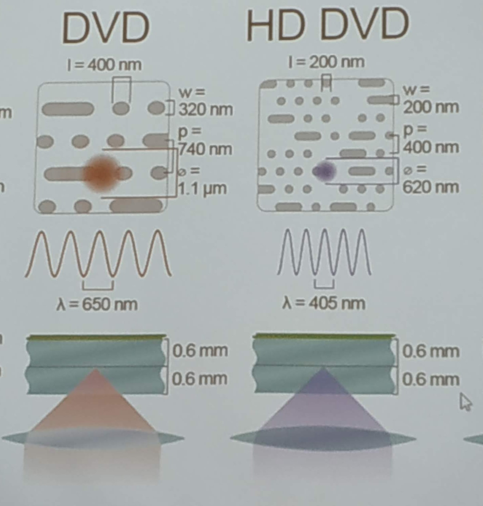

DVD - оптический накопитель информации, имеет 4,7Gb или 8,5Gb (HD DVD).

Длина лазера - 650nm (HD DVD - 405nm).

DVD имеет уменьшенную питу (углубление) в два раза по сравнению с CD, а также уменьшенное расстояние между треками. Служебная информация стала занимать меньше места. Также из особенностей можно выделить: многослойность и двусторонность.

Виды:

- DVD-R - DVD диск однократной записи.
- DVD-RAM - DVD диск с технологией изменения фазы
- DVD -RW - перезаписываемый DVD диск с изменением фазы
- DVD +RW - перезаписываемый DVD диск с мультисессией

## № 34 (Устройство ЭЛТ монитора. Принцип формирования изображения.)

В CRT (ЭЛТ) мониторах в роли индикатора выступает электронно лучевая трубка.

Варианты мониторов:

- По режимам:
  - Растровые - изменение яркости отдельных точек.
  - Векторные - высвечивание точек в пределах знака-места. 
  - Текстовый режим - дисплей делится на отдельные знак-места.
- По цветам:
  - Монохромный (только одна лучевая трубка)
  - Цветные (3 луча (RGB))

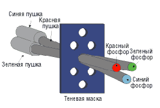

Теневая маска - пластина с отверстиями, которые по форме соответствуют расположению цветовых точек.

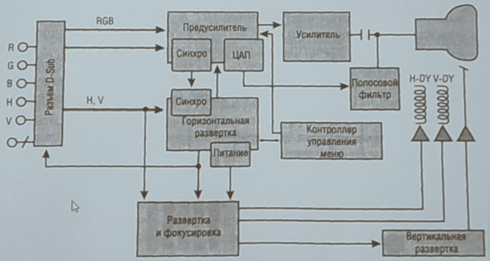

Компоненты CRT монитора:

- Буферный блок - для согласования сигналов и предобработки.
- Блок цветности - регулировка яркости, контрастности и формирование видео сигналов.
- Усилитель - усиливает сигналы основных цветов до уровня необходимого для модуляции.
- Блоки строчной и кадровой развёртки - для создания напряжений отклоняющих луч.
- Блок настройки - вывод меню настройки.

Принцип формирования изображения - испускаемый электронной пушкой пучок электронов, попадая на экран, покрытый люминофором, вызывает его свечение.

## № 35 (Дисплеи на жидких кристаллах (LCD). Принцип работы. Типы матриц.)

LCD (ЖК) экран представляет собой сложную многослойную конструкцию состоящую из плёнок поляризаторов, стеклянных пластин с прозрачными электродами, частей с жидкими кристаллами, фильтров и защитных покрытий.

Принцип работы LCD основан на свойстве жидких кристаллов изменять (поворачивать) плоскость поляризации проходящего через них света пропорционально приложенному к ним напряжению. То есть изменяя величину напряжения можно управлять количеством пропускаемого света.

Матрицы:

- Пассивная матрица (LED) - электроды адресации находятся внутри стеклянных пластин. Напряжения у каждой пластины.
- Активная матрица (OLED) - каждая точка адресуется индивидуально, смена изображения построчная.
- TFT матрицы.

## № 36 (Основные узлы ЖК-дисплея и их назначение. Достоинства и недостатки ЖК-дисплея.)

Основные элементы LCD (ЖК):

- Микропроцессор - управляет всеми основными элементами дисплея.
- Память конфигурации - содержит микропрограмму и настройки.
- Вычислитель АЦП - преобразует аналоговые входные сигналы в цветовой код.
- Контроллер LCD - выдаёт 16-битные коды каждого цвета на интерфейс LCD панели.
- Панель LCD - управляет транзисторами LCD матрицы (для лампы применяется применяется инвертор)
- Лампа подсветки / Светодиодные полосы

Достоинства LCD (ЖК) над CRT (ЭЛТ):

- Габариты и вес
- Меньше потребляемая мощность
- Меньше отрицательного влияния на организм человека (нет магнитных полей)
- Высокая чёткость
- Мобильность

Недостатки LCD (ЖК) над CRT (ЭЛТ):

- Битые пиксели (выгорание транзисторов)
- Плохое перенесение экстремальных температур
- Ограниченные углы обзора (В основном у старых дисплеев)
- Ориентированы на работу с одним разрешением

## № 37 (Видеоадаптеры. Основные узлы и их назначение.)

Видеоадаптер - сложное самостоятельное устройство, которое имеет один или несколько процессоров и выполняет: сканирование и цифро-аналоговое преобразование данных из кадрового буфера с последующим формированием видео сигнала.

Основные компоненты:

- Графический процессор

- Видео память

  Предназначена для хранения хранения цифрового образа формируемого изображения.  Память типа RAM

  Типы памяти:

  - VRAM (Video RAM) - двух портовая память
  - WRAM (Window RAM) - двух портовая память, обладает наилучшем быстродействием
  - SDRAM - синхронная динамическая память. Более быстродействующая. Есть синхронизация. Частота 200MHz
  - MDRAM (Multi Bank RAM) - разбита на банки данных
  - GDDR (DDR SDRAM) - работа на удвоенных частотах и высокое быстродействие

- Видео BIOS - для упрощения конфигурации видео адаптера

- RAM DAC - преобразует код цвет пикселя в аналоговый сигнал

- Sequensor - генерирует сигналы сканирования видео памяти

- Синхронизатор - обновление кадрового буфера во время сигнала гашения

- Тактовый генератор

- Интерфейс подключения

  - Аналоговый (VGA)
  - Цифровой (HDMI, Display Port)
  - Цифро-аналоговый (DVI)

Дополнительные функции:

- Аппаратное ускорение 2d и 3d графики
- Обработка видео данных
- Приём теле и видео сигнала

## № 38 (Матричные принтеры. Принцип действия. Достоинства и недостатки.)

Матричный принтер - переферийное устройство создающее изображение на бумаге из отдельных маленьких точек ударным способом.

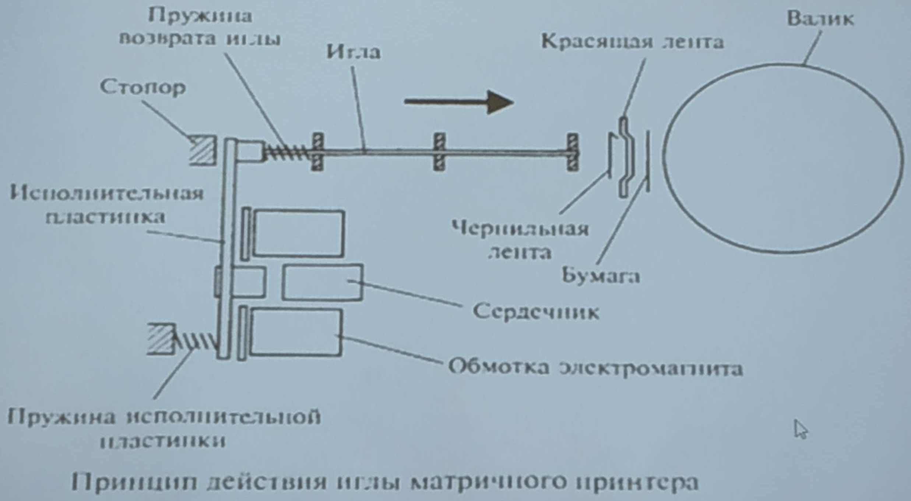

В матричном принтере изображение формируется на носителе печатающей головкой, представляющей собой набор иголок, приводимых в действие электромагнитами. Головка располагается на каретке, движущейся по направляющим поперёк листа бумаги, при этом иголки в заданной последовательности наносят удары по бумаге через красящую ленту, упакованную в картридж, тем самым формируя точечное изображение.

Режимы работы:

- Текстовый режим (код символа прописывается в знакогенератор)
- Графический режим (код местоположения точки)

Преймущества:

- Низкая стоимость печати
- Долговечная печать

Недостатки:

- Высокий уровнь шума
- Низкая скорость печати
- Низкое качество печати в графическом режиме

## № 39 (Струйные принтеры. Технологии нанесения изображения, виды печатающих головок. Достоинства и недостатки.)

Струйные принтеры - принтеры использующие технологию струйной печати, которая подразумевает перенос жидких чернил через сопло печатающей головки на бумагу.

Хранение чернил осуществляется двумя способами:

1. Когда печатающая головка является частью картриджа
2. Когда имеется отдельный сменный элемент с чернилами и соединяющийся с печатающей головкой по средством капилляров.

Методы нанесения чернил

- Пьезоэлектрический

  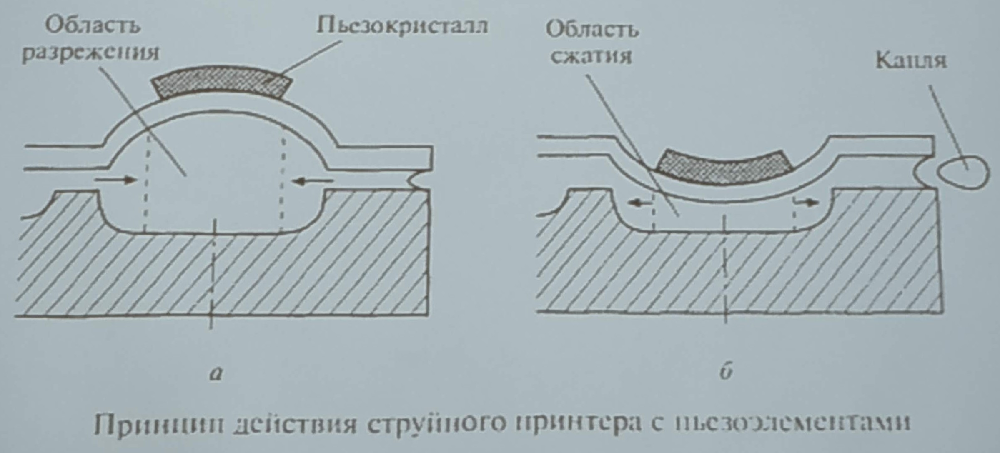
  

На мембране находится Пьезо кристалл, который под действием электрического поля изменяет свою форму. Чернил из области разряжения попадают через сопло на бумагу.
  Технология разработана компанией Epson

  Достоинства:

- Высока разрешающая способность
  - При замене картриджа, головка не заменяется

  Недостатки:
  
  - При цветной печати разрешающая способность в два раза меньше
  - Засыхание чернил в соплах
  
- Bubble-Jet

  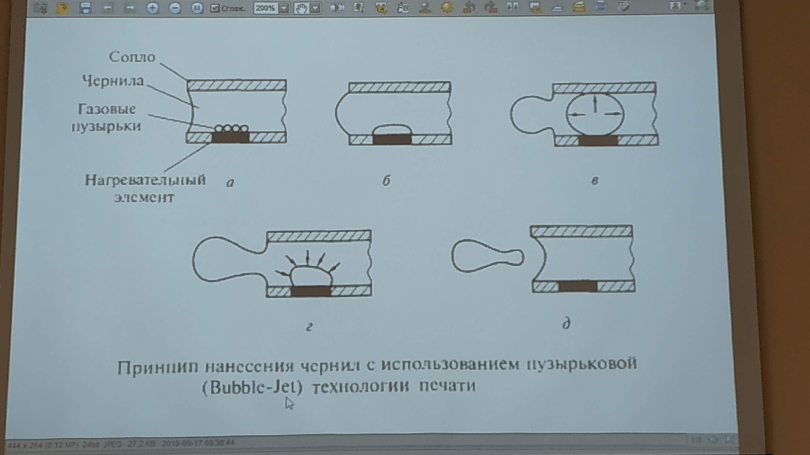

  При нанесении черни осуществляется нагрев до 500°С коротко временным напряжением

- Drop and demand

  Метод нанесения чернил разработанный компанией HP

  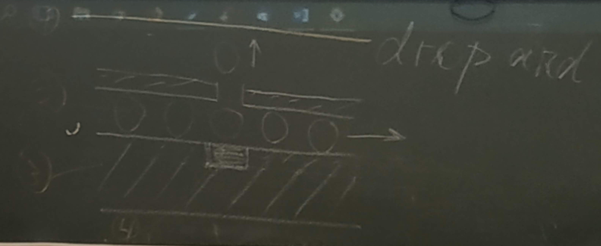

  1. Лист бумаги
  2. Капли чернил
  3. Печатающая головка
  4. Нагреватель - располагается напротив сопло. При этом часть чернил нагревается, а часть чернил выбрасывается избыточным давлением.

  Цветовая схема - CMYK

- Edge line

  В данной технологии используется неподвижная печатающая головка с диаметром 108mm. На ней располагается 5 групп сопел. На каждый цвет приходится 5000 сопел и диаметр капли 1pm (10^-12m).

  Достоинства:

  - Чёткость печати
  - Скорость печати
  - Хорошая масштабируемость

  Недостатки:

  - Засыхание чернил в соплах
  - Высокие эксплуатационные расходы
  - Плохая влагостойкость
  - Высокие требования к плотности бумаги

## № 40 (Лазерные принтеры. Виды лазерных принтеров. Принцип действия. Достоинства и недостатки.)

Лазерный принтер - один из видов принтеров, позволяющий быстро печатать текст и изображения на бумаге.

Виды:

- Ч/Б
- Цветные

Параметры влияющие на печать принтера:
1. Разрешающая способность 1200dpi
2. Технология улучшения печать (RET, TurboRES)
3. Качество тонера
4. Языки принтера (PCL5, PCL-6, HP-GL, PostScript)
5. Скорость печать

Используется фотоэлектрический метод печати. При помощи лазера "рисуется" изображение на фото чувствительном слое фотобарабана. При этом фотобарабан заряжается напряжением -5kV, в это время барабан-девелопер переносит тонер из бункера на фотобарабан и в систему подаётся бумажный носитель, заряжаясь каранирующим проводом +5kV. После чего лист бумаги проходит через фиксирующий валик при нагревающиеся до 180°С для закрепления изображения. При этом остатки тонера снимаются барабанами очистки.

Компоненты:

1. Процессор
2. Программируемая логическая матрица (ПЛМ)
3. Контроллер электрографического процесса
4. Электромагнитный соленоид
5. Узел считывания

Достоинства:

- Высокая скорость печати
- Хорошая масштабируемость
- Двухсторонняя печать

Недостатки:

- Большое потребление энергии
- Шум
- Недолговечный отпечаток
- Проблема озона

## № 41 (Термопринтеры и плоттеры. Виды принтеров. Принцип действия)

1. Термопринтеры - принтеры, в которых используется технология термопечати.

   Виды:

   - Термопечать - термочувствительная печать
   - Термоперенос - перенос тонера в следствии нагрева локальных точек носителя
   - Твёрдочернильная - используется кубики 4 цветов (CMYK - Cyan Magenta Yellow Key (Black))

2. Плоттер - устройство для автоматического вычерчивания с большой точностью рисунков, схем, сложных чертежей и карт. Рисунок наносится при помощи перемещающейся головки.

   Головки плоттера:

   1. Перьевые
   2. Струйный
   3. Лазерный

   Виды:

   - Планшетный плоттер - печатный носитель находится в неподвижном состоянии
   - Рулонный плоттер - бумага подаётся перпендикулярно направлению движения печатающей головки.

## № 42 (Клавиатуры. Принцип работы. Виды клавиш. Упрощённая схема клавиатуры.)

Клавиатура - устройство для ввода информации и подачи управляющих сигналов.

Сигнал при нажатии любой из клавиш регистрируется контроллером и передаётся в виде кода SCAN.
SCAN - одно байтный код. Младшие 7 битов являются присвоенным номером каждой клавиши.
Контроллер - находится на системной плате и является универсальной микросхемой интерфейса. Обрабатывает SCAN код и выдаёт аппаратные прерывания. Микроконтроллер прерывает свою работу и выполняет процедуру обработки SCAN кода. При поступлении кода от клавиш Alt, Ctrl, Shift, Fn происходит запоминание статуса (состояния), остальные клавиши запоминаются как код-символ. Далее обрабатывающая программа определяет установку клавиши и переключателей, чтобы правильно обработать код. После код помещается в буфер (память типа стек) клавиатуры (15 символов). Основной функцией клавиатуры является формирование ASCII кода.

Микроконтроллер выполняет в клавиатуре следующие функции:
- Автотестирование матрицы переключателей (опрос состояний линии сигналов, чтобы определить отсутствие запретов)
- Сканирование матрицы ключей (Хост контроллеров)

Тип клавиш:

- Механические - состоят из контактов и кнопок.

  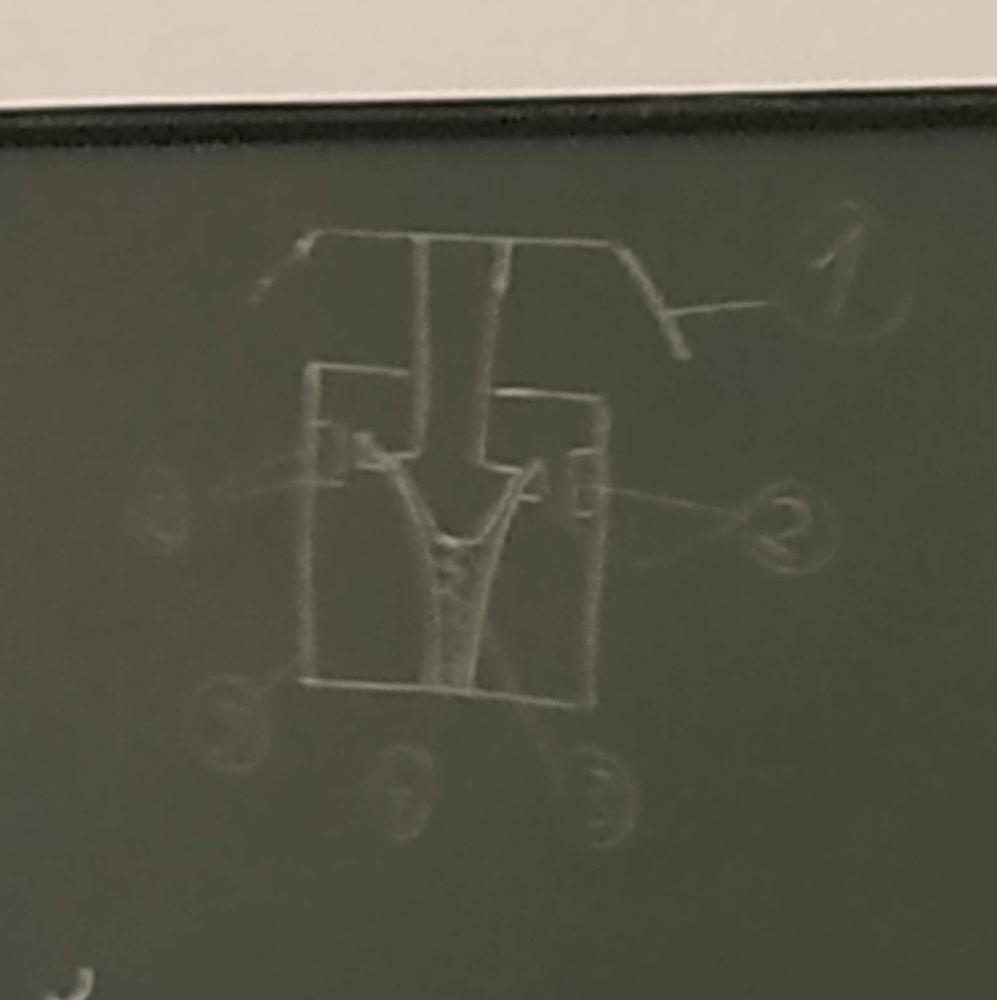

  Компоненты:

  1. Клавиша (Грибок)
  2. Контакты
  3. Гибкие токо проводящие пластины
  4. Пружина
  5. Корпус клавиши

- Полумеханические - используется полимерная плёнка в виде купола и площадка из токо проводящих элементов.

- Мембранная - клавиатуры с таким типом клавиш выдерживают большое кол-во нажатий и имеют высокую водоустойчивость.

  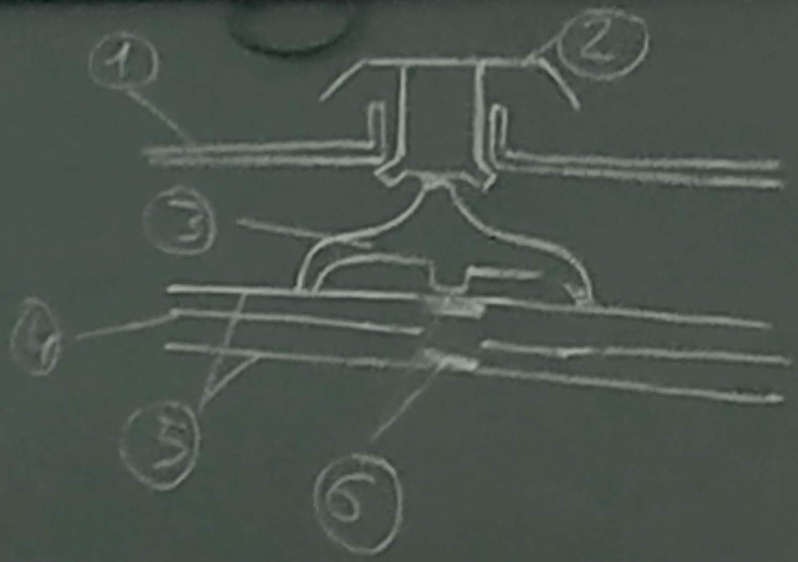

  Компоненты:

  1. Корпус клавиатуры
  2. Клавиша
  3. Мембрана
  4. Разделительная плёнка
  5. Плёнки с проводниками
  6. Токо проводящие контакты

Схема клавиатуры (упрощённая)

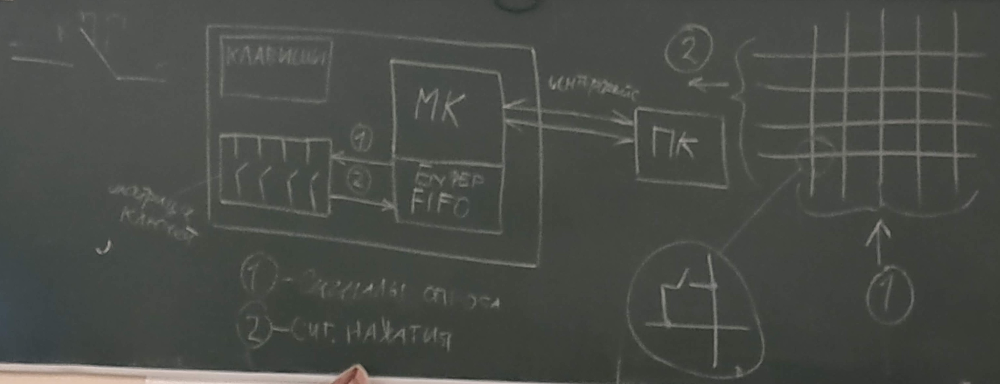

## № 43 (Назначение и типы сканеров. Виды светочувствительных датчиков.)

Сканер - периферийное устройство, которое позволяющее вводить в ПК изображение объектов, представленных в виде текста, рисунков, слайдов и фотографий на плоских носителях, а также изображение объёмных объектов маленького размера.

Светочувствительные датчики:

1. Фотоэлектронный умножитель - светочувствительный датчик представляет из себя колбу с расположенными внутри себя диодами.

   Световой поток попадая на катод выбивает из него электроны полученный фототок усиливается при помощи динодов (усиление 1500V, по 100V на каждую ступень).

   Достоинства:

   - Высокая скорость сканирования

   Недостатки:

   - Дороговизна

2. Прибор с зарядовой связью (CCD) - Состоит из множества светочувствительных элементов в основе прибора лежит возможность зависимости pn-перехода от степени освещённости. 

3. Контактные датчики изображения (CIS) - В сканерах с таким типом датчиков используются RGB диоды в сочетании с линейкой ПЗС (CCD). Датчики расположены очень близко к оригиналу. 

   Достоинства: 

   - Более компактный
   - Лёгкий
   - Простая оптическая система

Типы сканеров:

- Ручной

  Используется для сканирования малоформатных оригиналов или участков больших форматов. Все элементы сканера располагаются в небольшом корпусе, при этом сканер движущихся частей не имеет. Оператор перемещает сканер вручную. Разрешение сканера ~400 dpi. Питание сканера осуществляется от ПК.

- Планшетный

  Используется для сканирования бумаги или плоских объектов.

  Световой поток от источника света попадает на оригинал через стеклянную пластину, в зависимости от того какое изображение присутствует на оригинале меняется интенсивность отражённого светового потока. Световой поток, направляющих его на редукционную линзу, после чего световой поток попадет на линейку ПЗС датчиков. Аналоговый сигнал от ПЗС датчиков, поступает в АЦП. На выходе АЦП формируется соответствующий двоичный код.

- Роликовый сканер

  В таком сканере оригинал последовательно подаётся через систему роликов и попадает в поле зрения сканирующей головки.

- Сканер барабанного типа

  Данный сканер позволяет получать копии с высокой детализацией. Оригинал с помощью ленты или масла закрепляется на поверхности прозрачного цилиндра. Скорость вращения 300-500rpm. Рядом с цилиндром находится ФЗУ, который считывает изображение с высокой точностью. Используется в полиграфии.
  
- Проекционный

  Оригинал располагается на подставке под сканирующим узлом на расстоянии 30-40 см. Чтобы отсканировать объект камера перемещается относительно его. Настройка разрешения происходит при помощи специальной линзы.

## № 44 (Манипулятор типа "мышь". Виды, принцип действия.)

Мышь - периферийное устройство для ввода координат.

Основные компоненты:

- Корпус
- Механизм отслеживания перемещений
- Основные кнопки, скролл и функциональные кнопки
- Интерфейс соединения с ПК

Виды мыши:

1. Мышь с шаровым приводом

   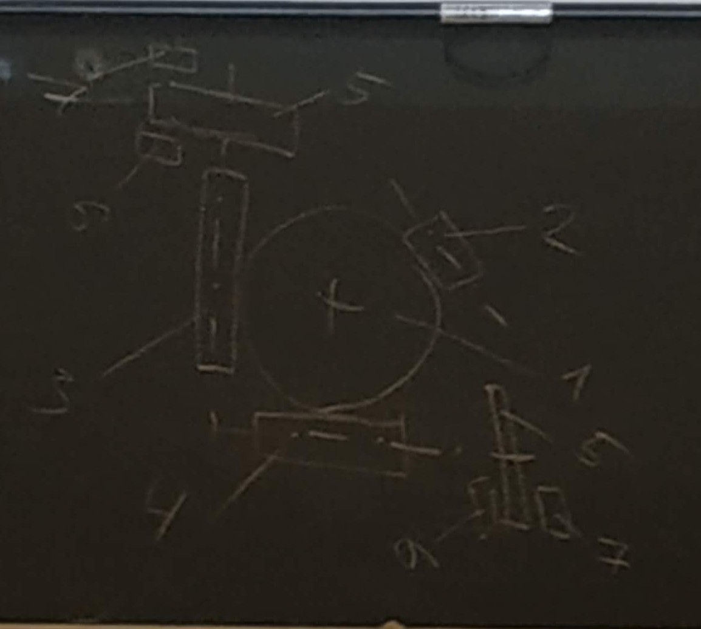

   Строение колеса:

   1. Металлический шар покрытый резиновым слоем
   2. Поддерживающий ролик
   3. Ролик перемещения мыши по оси X
   4. Ролик перемещения мыши по оси Y
   5. Диски с прорезями
   6. Источники света
   7. Фотоприёмники

   Координаты снимаются при перемещении манипулятора относительно поверхности при помощи двух роликов и шара. При вращении роликов вращаются диски с прорезями, тем самым прерывая световой поток и генерируя электрические символы.

   Совокупность фототранзистора и светодиода образует оптопару.

2. Оптические мыши

   1. Мыши зависящие от коврика

      Сверху размещены две пары диодов. Первый диод - красный свет, второй диод - инфракрасный свет. Для определения перемещения мыши используют специальный коврик с линиями, для горизонтальных - линии синего цвета, и вертикальных - серого. При перемещении над синей линией красный свет поглощается, а при перемещении над серой - инфракрасный. Таким образом, каждая из оптопар реагировала только на перемещение манипулятора в своем направлении, формируя последовательность электрических импульсов.

   2. Мыши не зависящие от коврика

      Внутри такой мыши в роли чувствительного сенсора играет роль миниатюрная камера, которая производит снимки поверхности с высокой скоростью. Снимки получаются 18x18.

3. Лазерные мыши

   Вместо светодиодов используется небольшой инфракрасный лазер. Освещение обеспечивает высокую контрастность для изображения, что позволяет выявлять подробности структуры поверхности. Оптический датчик в таких манипуляторах обеспечивает до 6000 снимков/сек.

   Достоинства:
   1. Выше точность позиционирования
   2. Лучше работа на различных типах поверхности

   Проводные интерфейсы:
   - COM порт
   - PS/2
   - USB

   Беспроводные интерфейсы:
   1. Радио мышь
   2. Bluetooth

4. TrackPoint

   Устройство находящееся в центре клавиатуры и действующее по принципу джойстика. То есть отклонений по осям X, Y.

5. TouchPad

   Сенсорная мышь. Основан на ёмкостном, либо резистивном принципе действия.

6. TrackBall

7. Гироскопическая мышь
